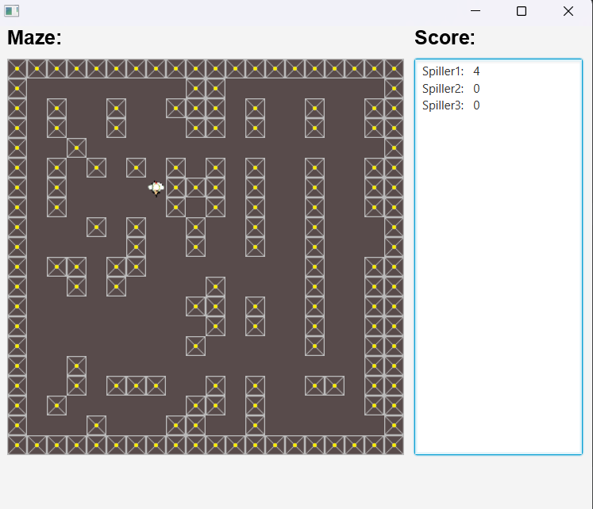

# Multiplayer Network Game

A multiplayer network game built with Java and JavaFX using TCP client-server communication.

## Project Description

This project is a multiplayer network game where multiple clients can connect to a central server and play simultaneously.

The application uses TCP sockets for communication between the clients and server. The server manages connected players and handles communication between the different clients.

Each client has a JavaFX graphical user interface and communicates with the server in real time.

The project was developed as part of my studies at Erhvervsakademi Aarhus.

## Features

- Multiplayer gameplay
- Client-server architecture
- TCP socket communication
- Multiple simultaneous clients
- Server-side player management
- Communication between clients through the server
- JavaFX graphical user interface
- Real-time game state updates
- Multithreaded server communication

## Technologies

- Java
- JavaFX
- TCP/IP
- Java Sockets
- Multithreading
- Git

## Architecture

The game uses a central client-server architecture.

```text
             ┌─────────────────┐
             │      Server     │
             │                 │
             │  Player Manager │
             │  TCP Sockets    │
             └────────┬────────┘
                      │
             ┌────────┴────────┐
             │                 │
       ┌─────▼─────┐     ┌─────▼─────┐
       │  Client 1 │     │  Client 2 │
       │            │     │            │
       │  JavaFX    │     │  JavaFX    │
       └────────────┘     └────────────┘
```

The server acts as the central communication point between connected clients.

Each client connects to the server using a TCP socket. The server handles communication and keeps track of the connected players.

## Communication

The application uses TCP sockets to provide reliable communication between the clients and server.

The server is designed to handle multiple clients simultaneously using separate threads for communication.

```text
Client 1 ──────┐
               │
               ▼
           ┌─────────┐
           │ Server  │
           └─────────┘
               ▲
               │
Client 2 ──────┘
```

This allows multiple players to participate in the same game while the server manages the shared game state.

## Project Structure

```text
src/
├── App/
│   └── App.java
├── Gui/
│   └── GUI.java
├── Image/
│   └── *.png
├── Player/
│   └── Player.java
├── Server/
│   ├── ReadThread.java
│   ├── ServerTraad.java
│   ├── TCPServer.java
│   └── WriteThread.java
└── module-info.java
```

### Main Components

- **App** – Contains the application entry point
- **Gui** – Handles the JavaFX graphical user interface
- **Player** – Represents players in the game
- **Server** – Contains the TCP server and communication threads
- **Image** – Contains images used by the game

## Server Communication

The server is responsible for:

- Accepting incoming client connections
- Managing connected players
- Receiving data from clients
- Sending data to clients
- Coordinating communication between players
- Handling multiple clients using threads

The client communicates with the server through TCP sockets.

## Local Setup

The game is configured to use `localhost` for local development and testing.

To run the project, start the server first and then launch the client application.

Multiple client instances can then connect to the same server to test multiplayer functionality.

## Screenshots

A screenshot of the game is included below.

### Game



## Project Context

This project was developed as a school project at Erhvervsakademi Aarhus.

The purpose of the project was to gain practical experience with network programming, client-server architecture, TCP communication, multithreading and graphical user interfaces.

The project was developed as part of a course focusing on distributed systems, integration and security.

## What I Learned

Through this project I gained experience with:

- Network programming in Java
- TCP socket communication
- Client-server architecture
- Managing multiple simultaneous clients
- Multithreaded server programming
- Sending and receiving data over sockets
- Managing shared game state
- Building graphical interfaces with JavaFX
- Structuring a larger Java application
- Using Git and GitHub for version control
